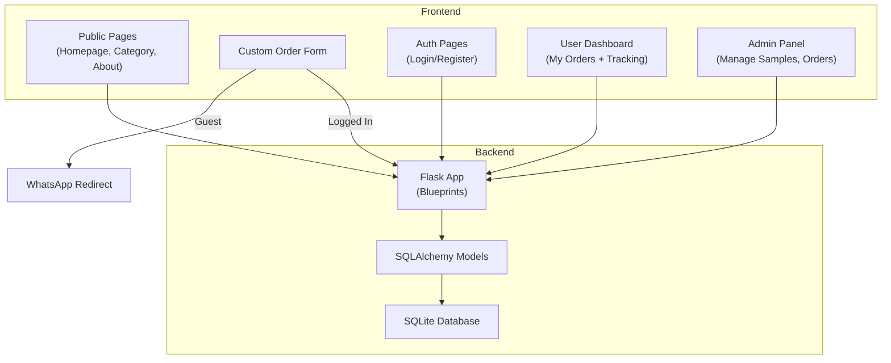
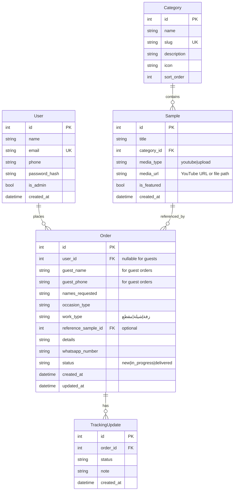

# سمو — Premium Arabic Audio Service Platform

A luxurious, mobile-first, RTL Arabic **production platform** for a Gulf audio brand specializing in زفات, شيلات, and custom audio content. Combines a premium frontend with a Flask backend for real order management, user accounts, and admin control.

## Architecture Overview

**Hybrid platform**: Flask backend (SQLAlchemy + SQLite) serving Jinja2 templates with shared CSS/JS. Two order flows:

1. **Guest flow** → WhatsApp redirect with pre-filled message (fast conversion)
2. **Registered user flow** → Order stored in database with tracking (new → in progress → delivered)



---

## Project Structure

```
studio_song/
├── run.py                      # Entry point
├── config.py                   # Configuration (secret key, DB URI, upload path)
├── requirements.txt            # Python dependencies
│
├── app/
│   ├── __init__.py             # Application factory (create_app)
│   ├── extensions.py           # db, login_manager, csrf init
│   ├── models.py               # All SQLAlchemy models
│   │
│   ├── routes/
│   │   ├── __init__.py
│   │   ├── main.py             # Homepage, about, category pages
│   │   ├── auth.py             # Login, register, logout
│   │   ├── orders.py           # Order creation, user dashboard, tracking
│   │   └── admin.py            # Admin panel (samples CRUD, order management)
│   │
│   ├── static/
│   │   ├── css/
│   │   │   ├── variables.css   # Design tokens
│   │   │   ├── base.css        # Reset, RTL, typography
│   │   │   ├── components.css  # Buttons, cards, nav, footer
│   │   │   └── pages.css       # Page-specific styles
│   │   ├── js/
│   │   │   └── main.js         # Interactions, animations, form logic
│   │   └── uploads/            # Uploaded sample files (audio/video)
│   │
│   └── templates/
│       ├── base.html           # Master layout (nav, footer, WhatsApp btn)
│       ├── index.html          # Homepage
│       ├── category.html       # Category page
│       ├── custom_order.html   # Order form
│       ├── about.html          # About page
│       ├── auth/
│       │   ├── login.html
│       │   └── register.html
│       ├── dashboard/
│       │   ├── my_orders.html  # User's orders list
│       │   └── order_detail.html # Single order + tracking timeline
│       └── admin/
│           ├── dashboard.html  # Admin overview
│           ├── samples.html    # Manage samples
│           ├── sample_form.html # Add/edit sample
│           ├── orders.html     # All orders list
│           └── order_detail.html # Update order status
```

---

## Design System

### Color Palette
| Token | Value | Usage |
|-------|-------|-------|
| `--gold` | `#D4AF37` | Primary accent, CTAs |
| `--gold-light` | `#F5E6A3` | Hover states |
| `--gold-dark` | `#B8960C` | Active states |
| `--black` | `#0A0A0A` | Primary background |
| `--black-card` | `#141414` | Card surfaces |
| `--black-elevated` | `#1E1E1E` | Elevated panels |
| `--black-border` | `#2A2A2A` | Borders |
| `--white` | `#FAFAFA` | Primary text |
| `--white-muted` | `#999999` | Secondary text |
| `--success` | `#2ECC71` | Delivered status |
| `--warning` | `#F39C12` | In progress status |
| `--info` | `#3498DB` | New status |

### Typography
- **Primary**: `Tajawal` (Google Fonts) — clean modern Arabic
- Fluid sizes with `clamp()` for responsive scaling

### Logo
- Text-based "سمو" logo with gold gradient, custom letter-spacing, and a subtle decorative line/accent

---

## Database Models



---

## Proposed Changes

### Backend Core

#### [NEW] [requirements.txt](file:///c:/Users/Owner/Desktop/studio_song/requirements.txt)
```
Flask==3.1.*
Flask-SQLAlchemy==3.*
Flask-Login==0.6.*
Flask-WTF==1.*
Werkzeug==3.*
```

#### [NEW] [config.py](file:///c:/Users/Owner/Desktop/studio_song/config.py)
- `SECRET_KEY`, `SQLALCHEMY_DATABASE_URI` (SQLite), `UPLOAD_FOLDER`, `MAX_CONTENT_LENGTH`

#### [NEW] [run.py](file:///c:/Users/Owner/Desktop/studio_song/run.py)
- Import `create_app`, run with debug mode

#### [NEW] [app/__init__.py](file:///c:/Users/Owner/Desktop/studio_song/app/__init__.py)
- Application factory with blueprint registration, extension init, upload folder creation
- `db.create_all()` inside app context for initial setup

#### [NEW] [app/extensions.py](file:///c:/Users/Owner/Desktop/studio_song/app/extensions.py)
- Initialize `SQLAlchemy`, `LoginManager`, `CSRFProtect`

#### [NEW] [app/models.py](file:///c:/Users/Owner/Desktop/studio_song/app/models.py)
- `User` (with password hashing via Werkzeug)
- `Category` (with slug for URL routing)
- `Sample` (supports YouTube URL or uploaded file)
- `Order` (nullable user_id for guests, status field)
- `TrackingUpdate` (status change log with notes)

---

### Route Blueprints

#### [NEW] [app/routes/main.py](file:///c:/Users/Owner/Desktop/studio_song/app/routes/main.py)
| Route | Method | Description |
|-------|--------|-------------|
| `/` | GET | Homepage — featured samples, categories, how-it-works |
| `/category/<slug>` | GET | Category page with filtered samples |
| `/about` | GET | About page |

#### [NEW] [app/routes/auth.py](file:///c:/Users/Owner/Desktop/studio_song/app/routes/auth.py)
| Route | Method | Description |
|-------|--------|-------------|
| `/login` | GET/POST | Login form |
| `/register` | GET/POST | Registration form |
| `/logout` | GET | Logout |

#### [NEW] [app/routes/orders.py](file:///c:/Users/Owner/Desktop/studio_song/app/routes/orders.py)
| Route | Method | Description |
|-------|--------|-------------|
| `/order/new` | GET/POST | Custom order form (guest → WhatsApp, logged in → DB) |
| `/order/quick/<sample_id>` | GET | Pre-fill order form with sample reference |
| `/dashboard` | GET | User's orders list (login required) |
| `/dashboard/order/<id>` | GET | Order detail + tracking timeline (login required) |

#### [NEW] [app/routes/admin.py](file:///c:/Users/Owner/Desktop/studio_song/app/routes/admin.py)
| Route | Method | Description |
|-------|--------|-------------|
| `/admin` | GET | Admin dashboard (stats overview) |
| `/admin/samples` | GET | List all samples |
| `/admin/samples/add` | GET/POST | Add sample (YouTube or upload) |
| `/admin/samples/<id>/edit` | GET/POST | Edit sample |
| `/admin/samples/<id>/delete` | POST | Delete sample |
| `/admin/orders` | GET | All orders list (filterable by status) |
| `/admin/orders/<id>` | GET/POST | View order + update status + add tracking note |

---

### Frontend — Templates

#### [NEW] [base.html](file:///c:/Users/Owner/Desktop/studio_song/app/templates/base.html)
- Master layout: `<html dir="rtl" lang="ar">`
- Google Fonts (Tajawal)
- Sticky nav with logo, links, login/register or user menu
- Sticky WhatsApp floating button
- Full footer (quick links, social media, contact, copyright)
- All CSS includes + JS at bottom

#### [NEW] [index.html](file:///c:/Users/Owner/Desktop/studio_song/app/templates/index.html)
1. Hero section (headline, subtext, 3 CTA buttons, gold gradient background)
2. Featured works grid (cards from DB)
3. Categories grid (5 tiles)
4. How It Works (3 steps)
5. CTA banner

#### [NEW] [category.html](file:///c:/Users/Owner/Desktop/studio_song/app/templates/category.html)
- Category title + description
- Sample cards grid
- "لم تجد ما تبحث عنه؟" banner

#### [NEW] [custom_order.html](file:///c:/Users/Owner/Desktop/studio_song/app/templates/custom_order.html)
- Full form (names, occasion, work type, details, WhatsApp number)
- If logged in → saves to DB; if guest → WhatsApp redirect
- Toggle visible based on auth state

#### [NEW] [about.html](file:///c:/Users/Owner/Desktop/studio_song/app/templates/about.html)
- Brand story, values, CTA

#### [NEW] Auth templates (login.html, register.html)
- Clean, premium-styled forms matching the brand

#### [NEW] Dashboard templates (my_orders.html, order_detail.html)
- Order cards with status badges (color-coded)
- Tracking timeline (vertical timeline with status updates)

#### [NEW] Admin templates (dashboard.html, samples.html, sample_form.html, orders.html, order_detail.html)
- Clean admin interface (same brand styling)
- Sample management with YouTube URL or file upload
- Order management with status update dropdown + notes

---

### Frontend — CSS

#### [NEW] [variables.css](file:///c:/Users/Owner/Desktop/studio_song/app/static/css/variables.css)
All CSS custom properties for the design system.

#### [NEW] [base.css](file:///c:/Users/Owner/Desktop/studio_song/app/static/css/base.css)
- Modern CSS reset, RTL direction, Tajawal typography
- Fluid type scale, selection styling, smooth scroll

#### [NEW] [components.css](file:///c:/Users/Owner/Desktop/studio_song/app/static/css/components.css)
- **Nav**: Sticky glass-morphism, mobile hamburger
- **Buttons**: Gold gradient primary, outlined secondary, WhatsApp green, status badges
- **Cards**: Sample cards with media preview + hover lift animation
- **Category tiles**: Grid with overlay
- **Steps**: Numbered cards with gold accents
- **Footer**: Multi-column dark footer
- **WhatsApp float**: Pulse animation, bottom-left (RTL)
- **Timeline**: Vertical tracking timeline
- **Forms**: Premium dark-themed inputs
- **Admin**: Tables, status selects, file upload zones

#### [NEW] [pages.css](file:///c:/Users/Owner/Desktop/studio_song/app/static/css/pages.css)
- Hero section, featured grid, category grid, form layout, dashboard, admin

---

### Frontend — JavaScript

#### [NEW] [main.js](file:///c:/Users/Owner/Desktop/studio_song/app/static/js/main.js)
- Mobile nav toggle
- Scroll reveal animations (Intersection Observer)
- Form validation + guest WhatsApp redirect logic
- YouTube embed lazy loading
- Smooth scroll for anchor links
- Admin: file upload preview, status change confirmation

---

## Key Design Decisions

> [!IMPORTANT]
> **"Inspired by singer" labels have been removed** per your request. Sample cards will show title, category, and media preview only.

> [!IMPORTANT]
> **Text-based logo**: "سمو" rendered with a gold gradient, elegant letter-spacing, and a decorative underline accent. No external image needed.

> [!NOTE]
> **Hybrid order flow**: The custom order form detects auth state. Guests see a "Send via WhatsApp" button. Logged-in users see "Submit Order" which saves to the database. Both options remain visible with clear labels.

> [!NOTE]
> **SQLite database**: Perfect for this scale. No external DB server needed. The file lives at `instance/sumo.db`. Can be migrated to PostgreSQL later if needed.

> [!WARNING]
> **WhatsApp number**: Currently set to a placeholder `+966XXXXXXXXX`. You must update this in `config.py` before going live.

> [!NOTE]
> **Admin access**: The first user created will need to be manually promoted to admin by setting `is_admin=True` in the database, or I can add a CLI command to create an admin user.

---

## Verification Plan

### Automated Tests
1. Run `python run.py` and verify the server starts
2. Browser test all public pages (homepage, categories, about, custom order)
3. Test user registration and login flow
4. Test order submission (both guest WhatsApp redirect and logged-in DB save)
5. Test admin panel (add/edit/delete samples, view/update orders)
6. Test responsive layout at 375px, 768px, 1280px
7. Verify RTL rendering and Arabic text

### Manual Verification
- Visual review of all pages for premium aesthetic
- Test mobile menu and sticky WhatsApp button
- Verify order tracking timeline displays correctly
- Verify YouTube embeds and file upload work in admin
